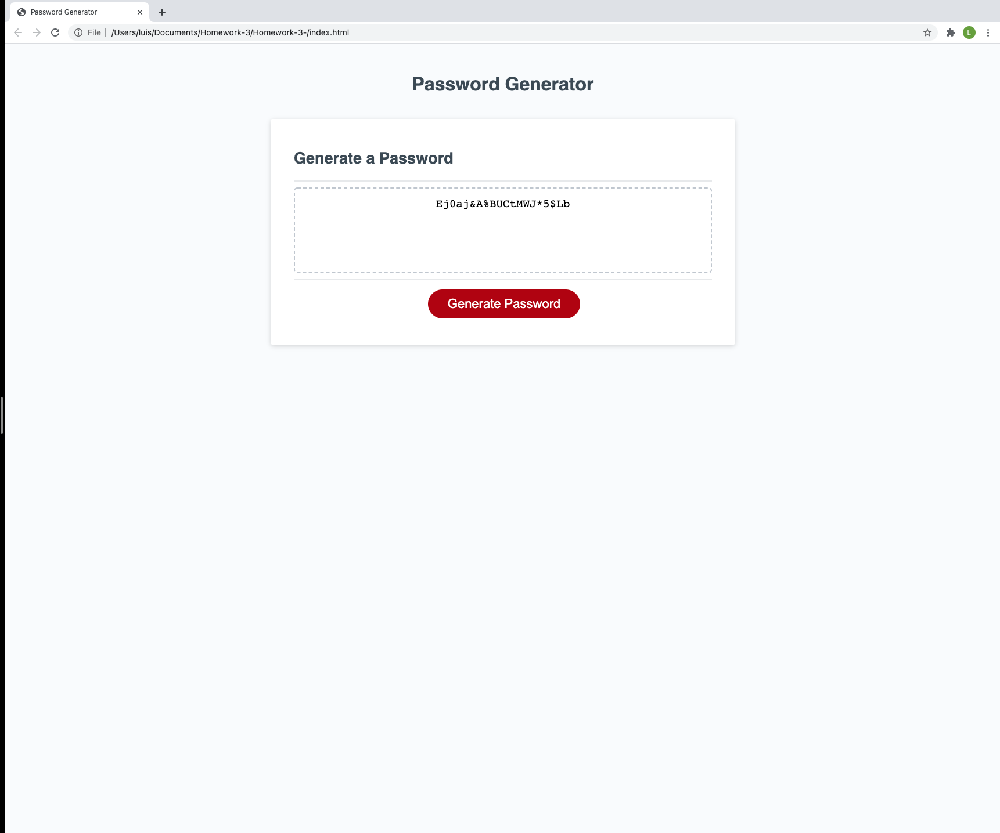

# Homework 3

## Overview:

The purpose of this assignment was to create a password generator to satisfy customer securityon the website.

## Implementation Details

1. Incorporation of Javascript file, encapturing the criteria of passwords required by the user.

2. Implementation of Javascript properties such as functions, object and variables to then be defined as a global function for generating the desired password.

3. Generated comments along the Javascript file for clarity within the code.

## Screenshot

## Deployed Application

Please click on the following link for application:

https://luisbonilla89.github.io/Homework-3-/.

# Lisence

MIT
